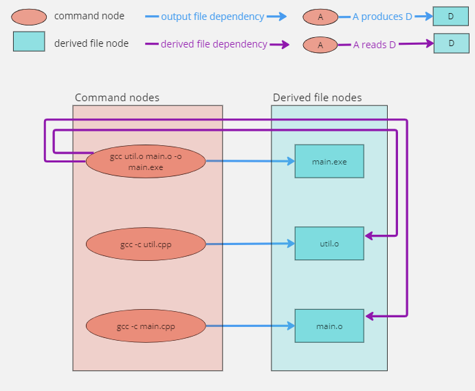
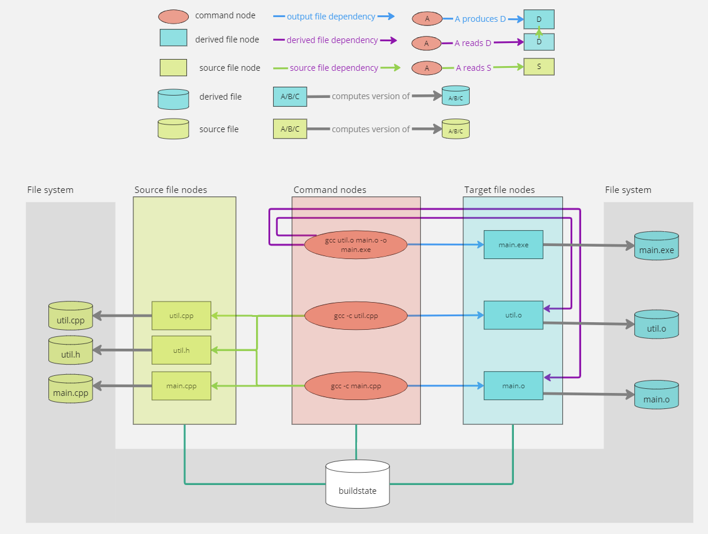

# Introduction

This document gives a detailed overview of the design of YAM.

The document is intended to be read by the users of YAM and by the developers
working on design and implementation of YAM. Some sections are primarily 
targeted to YAM developers. These sections are identified as such.

The document focusses on definition of terms and concepts.
 ***Bold italic font*** is used on introduction of a new term.
 Terms are defined before they are used. The document is therefore best read
 sequentially.

The design of YAM is all about:
- its Directed Acyclic Graph (DAG)
- how the DAG is used to perform builds

## The example software system

This document uses an example C++ software system to illustrate many of the 
YAM design aspects. The example software system consists of: 
- a C++ utility library consisting of files util.cpp and util.h.
  util.cpp includes util.h
- a main module main.cpp that uses the util library
  main.cpp includes util.h

This software is built by the following commands:
```
    gcc -c util.cpp               // compile util.cpp into util.o 
    gcc -c main.cpp               // compile main.cpp into main.o 
    gcc util.o main.o -o main.exe // link util.o and main.o into main.exe
```

# Directed Acyclic Graph (DAG)

Like all build systems YAM uses a DAG as its main data structure.  
Question to chatGPT:  
Explain the use of a directed acyclic graph in software build systems

The answer of chatGPT:  
A directed acyclic graph (DAG) is a data structure that consists of nodes 
connected by directed edges, where the edges only flow in one direction and
there are no cycles. DAGs have various applications in computer science, 
including software build systems.  

In the context of software build systems, a DAG is often used to represent the
dependencies between different components or modules of a software project. 
Each node in the DAG represents a component, and the edges represent the 
dependencies between the components. The directed edges indicate the direction
of dependency, meaning that one component depends on another for its build or
execution.

Here's how a DAG is used in a software build system:

Dependency Management: The DAG helps manage dependencies between components. 
When a component changes, only the components directly or indirectly dependent
on it need to be rebuilt. By traversing the DAG, the build system can determine
the minimal set of components that need to be rebuilt, avoiding unnecessary 
builds and saving time.

Build Order Determination: The DAG defines the order in which components should
be built. Since the edges in the DAG indicate the dependencies, a build system
can traverse the DAG in a topological order, where each component is built 
after all its dependencies have been built. This ensures that a component is 
built using the most up-to-date version of its dependencies.

Incremental Builds: With a DAG, a build system can perform incremental builds 
by tracking changes in the DAG. When a component or its dependencies change, 
the build system can identify the affected components by examining the paths in
the DAG and rebuild only those components. This approach saves time by avoiding
unnecessary rebuilding of unaffected components.

Parallelization: The DAG allows for parallel execution of independent build 
tasks. Since a DAG represents the dependencies between components, build tasks
that are not dependent on each other can be executed concurrently. This enables
the build system to take advantage of multi-core processors or distributed build
environments, leading to faster builds.

Popular software build systems like Make, Apache Maven, and Gradle utilize DAGs
to manage dependencies, determine build order, and optimize the build process.
By representing the dependencies between components as a DAG, these build
systems can efficiently and accurately build software projects while minimizing
unnecessary work and maximizing parallelization.

End of chatGPT answer.

# The YAM DAG

## Node types

A YAM DAG contains nodes (vertices) with the following types:
- ***Command node***   
  A command node is associated with a ***command script***. A command script can either be a single command, e.g. gcc -c util.cpp, or a shell script.   
  A command node is capable of producing one or more ***output files*** by
  executing the command script. An output file is produced by one and only one command.    
  The user defines commands, their command scripts and their output files in
  one or more ***build files*** (a.k.a. make files).
- ***Derived file node***  
  A derived file node is associated with an output file of a command. The output 
  file is derived, by a command node, from one or more input files. E.g. util.o is\ derived from util.cpp and util.h.
- ***Source file node***  
  A source file node represents a file that is not a derived file.  
  Source files are created/modified by users of YAM and are typically version
  controlled, e.g. stored a git repository. E.g. util.cpp, util.h and main.cpp are source files.
- ***Source directory node***  
  A source directory node represents a directory that contains source files.
- ***Build file node***  
  A build file node is capable of parsing a build file. From the definitions
  in the build file it creates new command nodes and/or updates existing command nodes
  and/or removes obsolete command nodes.

Note: the term file node is not to be confused with file: file nodes exist in the DAG,
files exist in the filesystem.

Note: the phrase "...a file node F where file F..." is shorthand for  "...a file node F where the file represented by F..."

Note: the phrase "...executing command C..." is shorthand for  "...executing the command script associated with command node C..."

Note: all nodes are capable of computing their version. Node versions are explained in [this section](#finding-the-command-nodes-to-execute).

## Dependency types

A YAM DAG contains dependencies (edges) of the following types:
- ***Output file dependency***  
  An edge from a command node to a derived file node where the derived file
  node represents a derived file that is produced by the command.
- ***Source file dependency*** 
  An edge from a command node to a source file node that represents a source
  file that is read by the command.
- ***Derived file dependency***  
  An edge from a command node C to a derived file node F where:
  - file F is output of some command node P, P != C
  - file F is read by command node C
  A dependency on derived file node F tells YAM to execute P before C to make
  sure that C uses an existing and up-to-date F. A derived file dependency dictates
  build order.

Although the graph is directed and acyclic YAM supports efficient bi-directional 
traversal of edges:
- given a source or derived file node F YAM can quickly find the command nodes that
  read file F.
- given a derived file node F YAM can quickly find the command node that produces file F.

## The initial DAG

The initial DAG is the graph before the first build and is constructed from information stored in build files.  
For for our example software system the initial DAG looks as follows:
<figure>
    
    <figcaption>DAG of the example software system before first build.</figcaption>
</figure>

# The YAM build 

On completion of a successfull build all output files are up-to-date, i.e. output files are:
- produced by commands as defined in the latest build files
- produced by commands using up-to-date derived input files
- produced by commands using the latest versions of source input files.
- deleted if the output file definition is no longer present in the latest build files

## Incremental build

All YAM builds, also the very first one, are incremental builds.  
A YAM ***incremental build*** is a build where YAM executes a command node if and only if one or more of the following is true:
- Output files of the command node do not exist.  
  E.g. zero output files exist at time of the first build and all commands are
  executed.  
  Note: a build that executes all commands is called a full build. For YAM a full
  build is just like any build.
- Output files of the command node were tampered with.  
  E.g. an output file was deleted by the user.
  Note: the wording 'tampered with' is used because users are not supposed to
  modify or delete output files.
- Command script of the command node was modified (in a build file).
  E.g. the user modified a build file to add options to the gcc command line.
- Derived file dependencies of the command node were modified/added/removed (in a build file).  
  E.g. the link command is executed because util.o was recompiled.
- Source file dependencies of the command node were modified.
  E.g. the user edited/renamed/deleted a source file.

## Incremental build overhead

The overhead of an incremental build is dominated by the time needed to detect which 
files have changed since the previous build. The user experiences this overhead as the time between starting the build and the time that command executions begin.

## Implicit source file dependencies

For a correct incremental build all source and derived file dependencies must
be in the graph. The initial graph, i.e. the graph before the first build,
however does not contain the source file dependencies of the compilation commands.  
How then can YAM guarantee correct incremental builds?  

YAM guarantees correct incremental builds by:
- tracing all file access performed by an executing command. 
- adding, for each accessed source file, a source file node to the source file
  dependencies of the command node.

These so-called ***implicit source file dependencies*** relieve the user from the error-prone task of defining source file dependencies in the build files. Error-prone because:
- Not defining used source file dependencies causes incorrect build results
- Defining not-used source file dependencies causes unnecessary command re-executions

## Buildstate

After a build the DAG contains more information than is present in the build files:
- Source file dependencies
- Versions of all derived and source files.

The YAM ***buildstate*** is the DAG augmented with the implicit source file dependencies, [file node versions](#file-node-version) and [command node versions](#command-node-version).

After execution of the initial build the state of the system is as follows: 
<figure>
    
    <figcaption>File system and DAG of the example software system after first build.
    </figcaption>
    <figcaption>Detected source file dependencies are added to the graph and the DAG 
    is stored in the buildstate.</figcaption>
</figure> 

This buildstate is essential for YAM's incremental build. YAM therefore stores, after
each build, the buildstate in a file.

## Finding the command nodes to execute.

This section explains how YAM uses dirty bits, file versions and command node
versions to find the command nodes that need to be executed.

### File node version

The ***file node version*** is a hash of the content of the file associated with 
the node. The file node version is computed for both source and derived file nodes

Note: computing for each build all file node versions is too expensive. YAM 
therefore only re-computes a file node version when the file last-write-time 
changed since the previous build. Last-write-time and version are stored in the
file node.

### Command node version

A ***command node version*** is a hash of:
- The file node versions of all source and derived file dependencies.
- The command script version  
  The ***command script version*** is a hash of the command script text.

The command node version is updated after completion of command execution.

### Dirty bit

Each node (command, derived, source) has a ***dirty bit***. A set dirty bit
indicates that the node version is possibly out-dated and that it needs to be updated.  
[Processing a build request](#processing-a-build-request) explains what it means to 
update a node.

The dirty bit of a file node is set when there has been, or may have been, 
write-access to the file. The set bit is propagated to all command nodes that 
have an output, derived or source file dependency on the file.

The dirty bit of a command node is also set when its script and/or its set of
output dependencies is modified. The set bit is propagated to the output file
dependencies of the command node.

Setting the dirty bit propagation is recursive. Clearing the dirty bit is not.

**TODO**: add figures examples showing the dirty nodes in the buildstate after 
modification of an output file, a source file and command.

## Client-server design

YAM uses a client-server design for the following reasons:
- Loading the buildstate for each new build is too time-consuming.  
  This is avoided by letting the server cache the build state.
- Finding all files that were write-accessed since the previous build is 
  time-consuming.  
  This is avoided by letting the server subscribe at the filesystem to be notified
  of file write-accesses. The server handles these notifications by setting
  the dirty bit of affected file nodes. Only files whose dirty bit is set
  need to be inspected for change.

Client responsibilities:
- Start the server if it was not yet running.
- Parse the command line.
- Send a request to the server to perform a build. 
- Receive progress messages from the server and display them.
- Receive completion message from the server and exit.

Server responsibilities at startup:   
- Cache the buildstate in memory for the lifetime of the server.
- Set the dirty bit of all file nodes.  
  Needed because files may have been write-accessed while the server was down.
- Subscribe to the filesystem to be notified of write-access to files.

Server responsibilities after startup:  
- Queue received write-access notifications for later consumption.
  Notifications are also queued during a build, thus allowing YAM to detect
  source file write-access during the build.
- In between builds: periodically consume write access notifications.  
  ***Notification queue consumption*** sets the dirty bits of the file nodes associated with the
  write-accessed files and clears the notification queue.
- Optionally: periodically update the dirty file nodes.  
  This avoids having to update these nodes during the build itself, thus
  delaying updates of command nodes.  
  [Processing a build request](#processing-a-build-request) explains what it means to 
  update a node.
- Perform a build on the cached buildstate on receipt of a client request.
- Store the buildstate on completion of build. 

Note: the write-access notifications are fundamentally different from the file-access
tracing described in section [Implicit Dependencies](#implicit-source-file-dependencies). The latter monitors the file-access performed 
by one specific process, being the process that executes the command script. The former
monitors write-access to files by any process without YAM caring about the process.

### Processing a build request 

TODO: explain mirroring of source file repository.

On receipt of a build request from the client the server performs the following steps:
1. Consume the notification queue. 
   Consumption sets the dirty bits of the file nodes associated with the
   write-accessed files and clears the notification queue. It is needed because
   new notifications may have been received since the last periodic consumption.
2. Collect all dirty nodes.
3. Update the collected dirty derived file, source file and source directory nodes.
4. Reparse modified build files
3. Update the collected dirty (file and command) nodes.
4. Store the buildstate.

***Updating a file node*** entails:
1. Retrieve the file last-write-time.
2. Compute the file version if and only if the last-write-time has changed.
3. Store the last-write-time and file version in the file node.
4. Clear the dirty bit.

***Updating a command node*** entails:
1. Update its output file dependencies.
2. Update the command nodes that produce its derived file dependencies.  
   This recursive process ensures proper build order. The recursion ends at the 
   leafs of the graph, being the source file nodes.
3. Update its source file dependencies.
4. Compute the command node version.  
Note that steps 1..3 ensure that the version is computed from up-to-date 
versions of the derived and source file dependencies. 
5. Execute the command script if and only if the newly computed command version
differs from the version computed in the previous build.
6. If executed: update the source file dependencies as described in section [Implicit Dependencies](#implicit-source-file-dependencies).
6. If executed: set the command node version to the new version.
7. Clear the dirty bit.

Note: many build systems use the file last-write-time as if it was the file version.  
An advantage of YAM using a file version, being is a hash of the file, is that this avoids unnecessary command re-executions.  
Example: in YAM editing a source file, saving it (and not starting a build), undoing the edits and then starting build will not cause re-execution of commands that depend on the file because, although the file 
last-write-time has changed, the file version has not.  
Example: editing only comments in a source file, then running a build. The build will recompile the source file but the resulting object file does not change. Link commands
that depend on the object file will not re-execute because, although the object file 
last-write-time has changed, the object file version has not.  

A disadvantage is the additional cost of hashing the file content. For situations 
where hashing is considered a too large overhead YAM can be configured to compute
the file version as a hash of the file last-write-time.

### File aspect version

The previous section explained how the use of YAM file versions prevent unnecessary 
command re-executions. But still scenarios exist in wich commands are re-exeucted 
without need. Such unnecessary re-executions can be avoided by using so-called
file aspect versions.  

A file aspect version is a hash of an aspect (a well-defined subset of the content) 
of the file. Examples:
    - The code aspect version' is a hash of the code sections in a source code
      file. Comment sections are excluded from the hash computation.
    - The comment aspect version is a hash of the comment sections in a
      source code file.

Note: the file version as defined in section [File version](#file-node-version) is 
shorthand for entire file aspect version, i.e. a hash of all the file content.

YAM allows the user to configure a command node to compute its command node version
from specific file aspect versions of its (derived and source) file dependencies.

A few examples illustrate the use of file aspect versions.

### Example - compilation

Re-compiling a C++ file that only has changes in comment sections will produce 
the same object file. In YAM such an unnecessary re-compilation can be avoided
by configuring the compilation command node to compute its command node version
from the code aspect versions (instead of from the entire aspect versions) of 
its input files.

Benefit: you have no more excuses to refrain yourself from improving the
comments in a C++ include file because of the massive amount of re-compilations
that would otherwise be triggered by such a change.

Note: some compilers, e.g. the Microsoft C++ compiler, are not deterministic:
they will not produce a bitwise identical object file when re-compiling the same 
source file or when re-compiling a source file where only comment was changed.
The produced object file is (of course) functionally identical.
Non-determinism is often caused by the inclusion of file path names and file 
last-write-times in the object file. 

### Example - linking of dynamic link libraries

Dynamic link libraries are supported by operating systems like Linux (.so files)
and Windows (.dll files). A dynamic link library has an external interface
and an implementation. Such a library enables an application to load and link
at run-time a different version (e.g. one that contains bug fixes) of the library
as long as it has the same interface.
This example focuses on Windows but similar reasoning applies to Linux.

In the Windows operating system a dynamic link library C.dll has an associated
so-called import library C.lib. The import library contains, amongst others, the
interface of the dll: its exported symbols and the name of the dll. 
Windows dictates that executables and dlls that require C.dll to be linked at 
run-time must be statically linked with C.lib. Relinking of exes and dlls link
C.lib is only necessary when the interface section of C.lib has changed.

In YAM this can be achieved by configuring the link task to depend on the 
interface aspect version of its .lib input files. The interface aspect version 
is a hash of only the interface section of the .lib file.

Benefit: in Windows the import lib of a dll changes when the implementation or 
interface of the dll changes. In addition the Windows linker is non-deterministic, 
so even re-linking the dll from unchanged inputs will produce a changed import
library. Using the entire file aspect of the import lib will thus cause
re-linking of all dlls and exes that depend directly and indirectly on the 
chanaged import lib. In large software systems the dll dependency graph is often
very wide and/or deep, thus causing massive re-linking and long build times.  

The amount of re-linking is minimized when using the interface aspect version, 
instead of the entire file version:
    - when only dll implementation aspects were changed: only the changed dll  
      is re-linked.
    - when also dll interface aspects were changed: only the changed dll and
      the dlls and exes that directly depend on it will be re-linked.


### 

# Features

YAM is heavily influenced by Mike Shal's paper [Build System Rules and 
Algorithms](https://gittup.org/tup/build_system_rules_and_algorithms.pdf) 
and by the [tup build system](https://gittup.org/tup/)
The paper discusses typical problems in build systems and defines rules
and algorithms that solve these problems. Mike Shal implemented these
rules and algorithms in tup. And so does YAM, with additions and improvements
that intend to make it an even better build system than tup.
The following sections describe how YAM adheres to Mike Shal's Rules and 
Algorithms.

## Correctness - Incremental build

YAM only re-executes build tasks when necessary. This section explains how YAM 
implements this.  

YAM detects the in/output files of a build task as it gets executed. The name,
last-write-time and version (a hash of the file content) of each of these files
is stored in the DAG. When YAM detects that the last-write-time of a file has 
changed it re-computes the version of this file. When the version has changed
it re-executes all build tasks that depend on the changed file.

Note: many build systems, re-execute build tasks when a file last-write-time
has changed. In YAM editing a file, saving it, undoing all edits and then
running YAM will not cause re-execution of build tasks because, although the
file last-write-time has changed, the file version has not.

Note: the detection of input files by YAM implies that the user need not 
specify the C++ source files as input of the compile commands in the C++ 
example in section [DAG example](#dag-example). YAM will detect those input files 
and add them to the DAG. YAM also detects that a.obj and b.obj are outputs of the
respective compilation tasks and that a.obj and b.obj are inputs of the link task.
There is however no way for YAM to find out that the compilation tasks must be
executed before the link task. Best case the link fails because the object
files were not yet produced, worst case the link task links out-dated object
files. YAM therefore requires the user to specify the outputs of build tasks 
and for tasks that read those outputs to specify those output files as their inputs.

Note: YAM incremental build is entirely based on changes in input files, output files
and build task logic. YAM will not re-execute tasks after changes in environment 
variables, registry settings, etc. 

## Correctness - DAG enforcement

YAM uses the detected in/outputs to verify that the in/outputs in the DAG, as
declared by the user, match the detected in/outputs. YAM fails the build when 
detected in/inputs do not match declared in/outputs.  
Rationale:
- DAG enforcement ensures proper build order 
- DAG enforcement contributes to build reproducability

Note: inputs that are source files need not be declared by the user. YAM 
detects such inputs as the build task executes and adds them to the DAG.  

## Correctness - Reproducability

Some build tools (e.g. Buck, Bazel) implement reproducability by requiring the
user to specify all source file inputs of a build task. YAM believes that this
puts too large a maintenance burden on the user. E.g. imagine having to declare
(and maintain) the list of all files included (recursively) by a C++ file. 
Instead YAM detects which source files are read by a build task and automatically 
adds them to the DAG.

The info in the DAG can be used in several ways to facilitate reproduction
of a build: 
    - Copy all input files used by the build into a sandbox. The build can now
      reliably be reproduced by running it in the sandbox.
    - By comparing build states of builds A and B one can verify whether A and
      B are equal (i.e. use same build task logic, use same input versions and 
      produce same output versions).


## Scalability - Build avoidance by using file aspect versions

Definition: a file aspect version is a hash of an aspect (subset) of the file.
Examples:
    - The 'code aspect version' is a hash of the code sections in a source code
      file, excluding comment sections from the hash computation.
    - The 'comment aspect version' is a hash of the comment sections in a
      source code file.

The file version as defined in section 3.1 is shorthand for the 'entire file 
aspect version', a hash of all content of the file.

YAM by default configures a build task to depend on input file versions, i.e.
to re-execute when input file versions change.
YAM allows the build task to be re-configured to depend on changes in selected 
input file aspect versions, i.e. to re-execute only when the selected input
file aspect versions change.

### Example - compilation
Re-compiling a C++ file that only has changes in comment sections will produce 
the same object file. In YAM the compilation task can be configured to depend 
on the code aspect versions of its .cpp and .h input files, i.e. to re-compile
only when the code aspect version of one or more input files has changed. 
Rationale: you have no more excuses to refrain yourself from improving the
comments in a C++ include file because of the massive amount of re-compilations
that would otherwise be triggered by such a change.

### Example - linking of dynamic load libraries
In the Windows operating system a dynamic load library, e.g. C.dll, has a
so-called import library C.lib. Executables and dlls that want to load C.dll at
run-time must be statically linked with C.lib. Relinking of exes and dlls that
depend on C.lib is only necessary when the exports section (i.e. the interface
of the dll) of C.lib changes.
In YAM this can be achieved by configuring the link task to depend on the 
exports aspect version of its .lib input files. The exports aspect version is a
hash of only the exports section of the .lib file.
Rationale: when using plain file versions changing implementation and/or 
interface of a dll will recursively re-link all dlls and exes that depend on
the changed dll. In large software systems the dll dependency graph is often 
very wide and/or deep, thus causing massive re-linking.
Using the exports aspect version, instead of the plain file version, breaks the
recursive re-linking:
    - when only dll implementation aspects were changed: only the changed dll  
      is re-linked.
    - when also dll interface aspects were changed: only the changed dll and
      the dlls and exes that directly depend on it will be re-linked.

## Scalability - Build avoidance by using a build cache

Builds can be configured to store their outputs in a build cache and to
re-use previously stored outputs when possible, i.e. when build task logic and
all input file (aspect) versions are identical 

## Scalability - Beta build

Many build systems are alpha-build systems. An alpha build retrieves the 
last-write-times of all files involved in the the build to figure out which
files have changed since the previous build. The time complexity of an alpha 
build is therefore O(#AllFiles). A beta build only retrieves the last-write-
times of files that have been write-accessed since the previous build. The time
complexity of a beta build is therefore O(#ModifiedFiles). Beta build enables 
YAM to quickly start the build tasks that need to re-execute. Start time will 
be sub-second in the typical development scenario where only a few files were
modified since the previous build, also in a repository that contains a huge 
number of files.

Note: YAM uses a server that continuously monitors the file system to register
which files were write-accessed since previous build. The server also 
re-computes the versions of the write-accessed files in-between builds as to 
not delay build task execution when the user starts the next build.

Note: the first build after restart of the YAM server is an alpha build.

## Scalability - Parallellized execution

By default YAM parallellizes build execution by queuing independent build tasks
to a thread pool. The pool contains 1 thread per available processing core.
The user can adjust the number of cores used by YAM.  

YAM has gone to great length to minimize the amount of non-parallelizable code.
As shown by [Amdahl's law](https://en.wikipedia.org/wiki/Amdahl%27s_law)
serial code is detrimental for scalability.
YAM claims a speedup of ~800 when using 1000 cores to execute build tasks that 
each take 1 second, assuming tasks are independent (i.e. can run in parallel),
the build runs on a system with infinite large I/O bandwidth and zero overhead. 
E.g. a build that executes 1000 compilations that each take 1 second will take
1000/800 = 1,25* seconds. 
Note: scalability de/increases as build tasks execution time de/increases.

Note: YAM does not support out-of-the-box distributed execution. YAM can be 
integrated relatively easy with distributed execution tools like 
[Incredibuild](https://www.incredibuild.com/).


## Usability - One command

Running YAM is the only thing you need to (and can) do to build the system.
YAM takes care of:
    - re-executing build tasks that depend on the changed files/directories.
    - re-executing tasks after changes in their task logic.
    - deletion of stale output files. An output file becomes stale when the 
      build task that produced the file is changed to no longer produce this
      output.
    - detection of build order issues, as explained in section 3.2.

## Usability - Build files and build language

Build files contain the user-defined DAG. Build files are to be treated as
source files and should be version controlled. YAM parses the build files to 
construct the in-memory representation of the DAG. YAM (re-)parses only the build 
files that changed since the previous build.

The build file language has not yet been defined. Ideally YAM supports various main-stream build file languages in order to make it easy to migrate to YAM.

## Usability - Unbiased towards languages, tool sets and more

YAM makes no assumptions about the kind of build problem that the user tries
to tackle. In particular it makes no assumptions about used programming languages,
compilers, linkers, package managers, test frameworks, target hardwares, target
operating systems.
