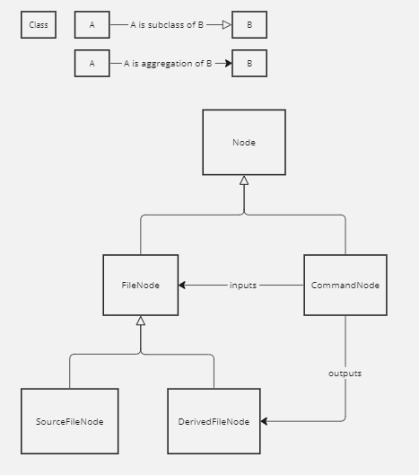
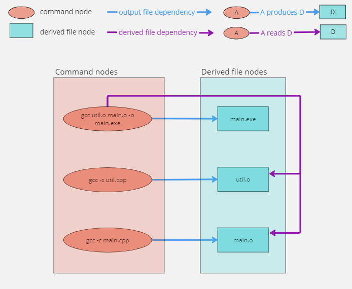
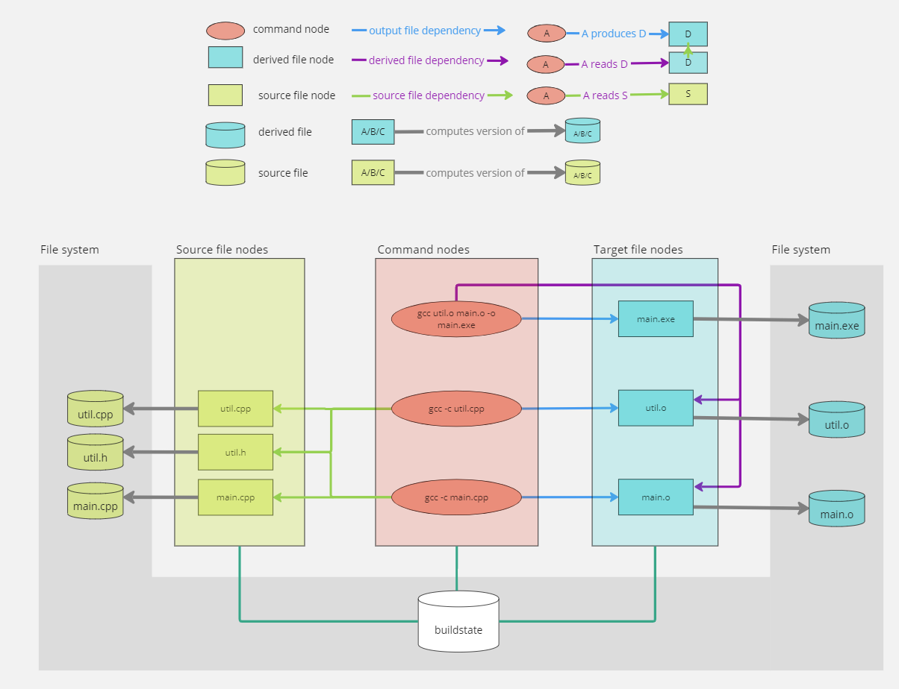

# Introduction

This document describes the design of YAM.

The document is intended to be read by the developers working on the design and
implementation of YAM. The document may also be interesting for users that want 
to gain a deeper understanding of YAM.

 ***Bold italic font*** is used when a new term is defined. Most terms are 
defined before they are used, else a reference to the definition of the term is
provided. The document is therefore best read sequentially.

The design of YAM is mostly about:
- its Directed Acyclic Graph (DAG)
- how the DAG is used to perform builds

## The example software system

Many design aspects are illustrated by using an example C++ software system. The
 example software system consists of: 
- A C++ utility library consisting of files util.cpp and util.h.
  util.cpp includes util.h
- A main module main.cpp that uses the util library.
  main.cpp includes util.h
- A set of commands used to build the system:
```
    gcc -c util.cpp               // compile util.cpp into util.o 
    gcc -c main.cpp               // compile main.cpp into main.o 
    gcc util.o main.o -o main.exe // link util.o and main.o into main.exe
```

## Directed Acyclic Graph (DAG)

Like all build systems YAM uses a DAG as its main data structure.  
Question to chatGPT:  
Explain the use of a directed acyclic graph in software build systems

The answer of chatGPT:  
A directed acyclic graph (DAG) is a data structure that consists of nodes 
connected by directed edges, where the edges only flow in one direction and
there are no cycles. DAGs have various applications in computer science, 
including software build systems.  

In the context of software build systems, a DAG is often used to represent the
dependencies between different components or modules of a software project. 
Each node in the DAG represents a component, and the edges represent the 
dependencies between the components. The directed edges indicate the direction
of dependency, meaning that one component depends on another for its build or
execution.

Here's how a DAG is used in a software build system:

Dependency Management: The DAG helps manage dependencies between components. 
When a component changes, only the components directly or indirectly dependent
on it need to be rebuilt. By traversing the DAG, the build system can determine
the minimal set of components that need to be rebuilt, avoiding unnecessary 
builds and saving time.

Build Order Determination: The DAG defines the order in which components should
be built. Since the edges in the DAG indicate the dependencies, a build system
can traverse the DAG in a topological order, where each component is built 
after all its dependencies have been built. This ensures that a component is 
built using the most up-to-date version of its dependencies.

Incremental Builds: With a DAG, a build system can perform incremental builds 
by tracking changes in the DAG. When a component or its dependencies change, 
the build system can identify the affected components by examining the paths in
the DAG and rebuild only those components. This approach saves time by avoiding
unnecessary rebuilding of unaffected components.

Parallelization: The DAG allows for parallel execution of independent build 
tasks. Since a DAG represents the dependencies between components, build tasks
that are not dependent on each other can be executed concurrently. This enables
the build system to take advantage of multi-core processors or distributed build
environments, leading to faster builds.

Popular software build systems like Make, Apache Maven, and Gradle utilize DAGs
to manage dependencies, determine build order, and optimize the build process.
By representing the dependencies between components as a DAG, these build
systems can efficiently and accurately build software projects while minimizing
unnecessary work and maximizing parallelization.

End of chatGPT answer.

# YAM DAG

In mathematics a graph contains vertices and edges. YAM does not follow this
terminology. Instead it uses the term ***node*** instead of vertex and the term
***dependency*** instead of edge.  

YAM also does not follow the typical implementation pattern where a graph is
stored as a list of vertices and a list of edges, an edge being a pair of vertex
ids. Instead YAM follows an object oriented design in which a node X contains a
list of dependencies, a dependency being a reference to a node on which node X
depends.  

The object oriented design implies that the YAM graph is fully described by its
node types (classes). The following sections introduce the most important node
classes. More node classes will be introduced in later sections.

## Node class diagram

The following class diagram shows the main node classes in YAM.

<figure>
    
    <figcaption>Main classes in YAM DAG
    </figcaption>
</figure> 

Node and FileNode are abstract base classes, i.e. they cannot be instantiated.  

The diagram does not restrict graphs to be DAGs. YAM however constrains its 
graph to be a DAG.

For an efficient build efficient bi-directional traversal of the input and
output arrows is required. YAM implements this by adding the following
redundant references:
- from FileNode to CommandNodes that use the FileNode as input
- from DerivedFileNode to the CommandNode that produces the derived file.

These references are not depicted in the class diagram.

## Node

Node provides a framework to (recursively) execute a node. Executing node X 
will:
1. Execute the ***prerequisites*** of X.  
   Prerequisites of X are nodes that produce output that is used by X.
   Prerequisites must hence be executed before X.  
   Providing the list of prerequisites is a sub-class responsibility.
2. Determine whether the output of X is out-dated.  
   This is a sub-class responsibility.  
3. ***Self-execute*** X if its output is out-dated.  
   Self-execution produces the output of X.  
   Self-execution is a sub-class responsibility.

A node has a name. This allows users to request YAM to execute a specific node
by specifying the node name on the YAM command line.  

## FileNode

A FileNode is associated with a file in the filesystem. The name of a FileNode
is the pathname of the associated file.  
FileNode self-execution computes the version of the file, the version being a 
hash of the file content.
A FileNode has no prerequisites.

Note: the computed file version is the output of the node execution.

Note: the term file node is not to be confused with file: file nodes exist in 
the DAG, files exist in the filesystem. In this document the term file is 
sometimes used as shorthand for its associated file node.

## DerivedFileNode

A DerivedFileNode is associated with a derived file. A derived file is an output
file of a [CommandNode](#commandnode).  
E.g. derived file util.o is derived from 
source files util.cpp and util.h by the command that compiles util.cpp.  
E.g. derived file main.exe is derived from derived files from util.o and main.o 
by the command that links main.exe.  

## SourceFileNode

A SourceFileNode is associated with a source file. A source file is a file that
is not a derived file. Source files are created/modified by users of YAM. E.g. 
util.cpp, util.h and main.cpp are source files.
  
## CommandNode

CommandNode self-execution executes a ***command script***, a shell script or
a single command like ```gcc -c util.cpp```.  
Self-execution produces one or more output files, represented by the output 
DerivedFileNodes.  
Self-execution also updates the ***command execution version***, a hash of the 
command script and of the versions of the input and output files. The 
execution version allows the command to determine whether its output files are
out-dated, i.e. whether no changes were made to its script, input and output 
files since the previous build.    
The prerequisites of a CommandNode are the union of:  
- The output DerivedFileNodes.
- The input SourceFileNodes.
- The CommandNodes associated with the input DerivedFileNodes. 
These prerequisites ensure that the command 'sees'' the latest versions of 
input and output files when determining whether its output files are out-dated.
The output files of the command are out-dated when the execution version 
computed from latest versions of input and output files is not equal to the
execution version as computed during last self-execution of the command.

The user defines commands in [Build files](#build-files).

## Command DAG

The ***command DAG*** is the graph that is constructed from information stored 
in the build files. The following figure shows the command DAG for the example 
software system.  

<figure>
    
    <figcaption>Command DAG of the example software system .</figcaption>
</figure>


# YAM build 

On completion of a successfull build all output files are up-to-date, i.e. output files are:
- produced by commands as defined in the latest build files
- produced by commands using up-to-date derived input files
- produced by commands using the latest versions of source input files.
- deleted if the output file definition is no longer present in the latest build files

## Incremental build

A YAM build is an ***incremental build*** because YAM only (re-)executes a command 
when one or more of its output files are outdated.  
An output file is outdated when one or more of the following is true:
- One or more of the output files of the command node do not exist.  
  E.g. no output files exist at time of the first build and all commands are
  executed.
  Note: a build that executes all commands is called a ***full build***. For YAM a full
  build is just like any build.
- Output files of the command node were ***tampered with***.
  An output file is said to be tampered with when it was deleted or modified by the user
  or by a software process other than the YAM build process.
  Note: the wording 'tampered with' emphasises that YAM owns the output files and that
  users are not supposed to delete or modify output files.
- Command node definition was modified.  
  Typically because the user modified a build file. E.g. to add compilation options to 
  the gcc compilation command, to add/remove object files to/from the derived file
  dependencies of the gcc link command.
- Derived file dependencies of the command node were modified.  
  E.g. the link command is executed because util.o was recompiled.
- Source file dependencies of the command node were modified.  
  E.g. the user edited/renamed/deleted a source file, e.g. a source code formatter 
  was applied to a source file.  
  Note: In-place source code formatting cannot be implemented as a YAM command because
  YAM does not support a file to be both source and derived file.

## Incremental build delay

The ***incremental build delay*** is the time between starting the build and the time that command execution begins. During this time YAM determines which commands need to be
executed. This time is dominated by the time needed to detect which files have changed
since the previous build.

The time complexity of YAM's incremental build delay is O(D) where D is the number of
files that were modified since the previous build. This ensures a sub-second delay for
the typical development scenario in which only a few files are modified, even in a SW 
system with hundreds of thousands of files.

## Buildstate

For a correct incremental build the graph must contain all source and derived file 
dependencies as well as all file versions used by the previous build. The command graph however does not contain source file dependencies nor file versions. How then can YAM guarantee correct incremental builds?  

YAM guarantees correct incremental builds by (during the build):
- Adding to each command node its ***implicit source file dependencies***.  
  The implicit source file dependencies are found by:
  - Tracing all file access performed by the executing command.  
  - Adding, for each accessed source file, a source file node to the source file
    dependencies of the command node.
- Adding to each source file node the file version used by the build.
- Adding to each derived file node the file version produced by the build.

Note: implicit source file dependencies relieve the user from the error-prone task of manually defining source file dependencies in the build files. Error-prone because:
- Not defining used source file dependencies causes incorrect build results
- Defining not-used source file dependencies causes unnecessary command re-executions

The YAM ***buildstate*** is the command DAG augmented with the implicit source file 
dependencies and source and derived file versions as found and computed during a build.  

Each build uses the buildstate left by the previous build to detect changes to files 
and commands and to decide which commands to execute, as explained in the next section. 
YAM therefore stores, after each build, the buildstate in a file.

After execution of the build the state the system is as follows: 
<figure>
    
    <figcaption>File system and buildstate of the example software system after build.
    </figcaption>
    <figcaption>Detected source file dependencies are added to the command graph.</figcaption>
    <figcaption>The resulting buildstate is stored in the filesystem.</figcaption>
</figure> 

## Finding the command nodes to execute.

This section explains how YAM uses dirty bits, file versions and command execution
versions to find the command nodes that need to be executed.

### File node version

The ***file node version*** is a hash of the content of the file associated with 
the node. The file node version is computed for both source and derived file nodes

Note: computing for each build all file node versions is too expensive. YAM 
therefore only re-computes a file node version when the file last-write-time 
changed since the previous build. Last-write-time and version are stored in the
file node.

### Command execution version

A command node contains a ***command execution version***, being a hash of the
command script and the of the file node versions of its input and output filest
- The command script version  
  The ***command script version*** is a hash of the command script text.

A command execution version is updated after completion of the command execution.

### Dirty bit

Each node (command, derived, source) has a ***dirty bit***. A set dirty bit
indicates that the node version is possibly outdated. A dirty node needs a 
***node update*** to determine whether the node version is indeed outdated 
and to recompute the version if it is outdated. [Processing a build request](#processing-a-build-request) explains in more detail what it means to 
update a node.

The dirty bit of a file node is set when there has been or may have been
write-access to the file. The set bit is propagated to all command nodes that 
have an output, derived or source file dependency on the file.

The dirty bit of a command node is also set when its script and/or its set of
output dependencies is modified. The set bit is propagated to the output file
dependencies of the command node.

Setting the dirty bit propagation is recursive. Clearing the dirty bit is not.

**TODO**: add figures examples showing the dirty nodes in the buildstate after 
modification of an output file, a source file and command.

##  9. <a name='Client-serverdesign'></a>Client-server design

YAM uses a client-server design for the following reasons:
- Retrieving the buildstate from file for each build is too time-consuming.  
  This is avoided by caching the buildstate in server memory.
- The incremental build delay must be O(D), D being the number of modified files since the last build. This can only be realized by continuously monitoring the filesystem.
  This is realized by letting the server subscribe at the filesystem to be notified
  of file write-accesses. The server handles these notifications by setting
  the dirty bit of affected file nodes.

Client responsibilities:
- Start the server if it was not yet running.
- Parse the command line.
- Send a request to the server to perform a build. 
- Receive progress messages from the server and display them.
- Receive completion message from the server and exit.

Server responsibilities at startup:   
- Cache the buildstate in memory for the lifetime of the server.
- Set the dirty bit of all file nodes.  
  Needed because files may have been write-accessed while the server was down.
- Subscribe to the filesystem to be notified of write-access to files.

Server responsibilities after startup:  
- Queue received write-access notifications for later consumption.
  Notifications are also queued during a build, thus allowing YAM to detect
  source file write-access during the build.
- In between builds: periodically consume write access notifications.  
  ***Notification queue consumption*** sets the dirty bits of the file nodes associated with the
  write-accessed files and clears the notification queue.
- Optionally: periodically update the dirty file nodes.  
  This avoids having to update these nodes during the build itself, thus
  delaying updates of command nodes.  
  [Processing a build request](#processing-a-build-request) explains what it means to 
  update a node.
- Perform a build, using the cached buildstate, on receipt of a build request.
- Store the updated buildstate on completion of a build. 

Note: the write-access notifications are fundamentally different from the file-access
tracing described in section [Buildstate](#buildstate). The latter monitors the file-access performed 
by one specific process, being the process that executes the command script. The former
monitors write-access to files by any process without YAM caring about the process.

###  9.1. <a name='Processingabuildrequest'></a>Processing a build request 

On receipt of a build request from the client the server performs the following steps:
1. Consume the notification queue.  
Consumption is needed because new notifications may have been received since 
the last periodic consumption.
4. Update the dirty nodes.
5. Store the buildstate.

***Updating a file node*** entails:
1. Retrieve the file last-write-time.
2. Compute the file version if and only if the last-write-time has changed.
3. Store the last-write-time and file version in the file node.
4. Clear the dirty bit.

***Updating a command node*** entails:
1. Update its output file dependencies.
2. Update its source file dependencies.
3. Update the command nodes that produce its derived file dependencies.  
   This recursive process ensures proper build order.
4. Compute the command execution version.  
Note that steps 1..3 ensure that the version is computed from up-to-date 
versions of the derived and source file dependencies. 
5. Execute the command script if and only if the newly computed command execution
version differs from the execution version computed in the previous build.
6. After execution: update the implicit source file dependencies as described in section [Buildstate](#buildstate).
6. If executed: set the command execution version to the new version.
7. Clear the dirty bit.

Note: many build systems use the file last-write-time as if it was the file version.  
An advantage of the YAM file version (a hash of file content), is that this prevents unnecessary command re-executions.  
Example: in YAM editing a source file, saving it (and not starting a build), undoing the edits and then starting build will not cause re-execution of commands that depend on the file because, although the file 
last-write-time has changed, the file version has not.  
Example: editing only comments in a source file, then running a build. The build will recompile the source file but the resulting object file does not change. Link commands
that depend on the object file will not re-execute because, although the object file 
last-write-time has changed, the object file version has not.  

A disadvantage is the additional cost of hashing the file content.
YAM can be configured to compute the file version as a (very inexpensive) hash of the file last-write-time for situations where the cost of hashing is considered too large.

# Advanced topics

##  10. <a name='Fileaspectversions'></a>File aspect versions

As explained earlier the use of YAM file versions prevent unnecessary 
command re-executions. But still scenarios exist in wich commands are
executed without need. Such unnecessary executions can be avoided by 
using ***file aspect versions***.  

A file aspect version is a hash of a specific subset of file content or file
properties.
For example:
    - ***code aspect version*** is a hash of the code sections in a source 
      code file. Comment sections are excluded from the hash computation.
    - ***comment aspect version*** is a hash of the comment sections in
      a source code file.

Note: the file version as defined in section [File version](#file-node-version)
is shorthand for entire file aspect version, i.e. a hash of all the file content.

YAM allows the user to configure a command node to compute its command node 
version from specific file aspect versions of its (derived and source) file
dependencies. A few examples illustrate the use of file aspect versions.

###  10.1. <a name='Example-compilation'></a>Example - compilation

Re-compiling a C++ file that only has changes in comment sections will produce 
the same object file. In YAM such an unnecessary re-compilation can be avoided
by configuring the compilation command node to compute its command execution
version from the code aspect versions (instead of from the entire file aspect 
versions) of its input files.

Benefit: software engineers no longer have to refrain themselves from
improving the comments in a C++ include file because of the massive amount of
re-compilations that would otherwise be triggered by such a change.

Note: some compilers, e.g. the Microsoft C++ compiler, are not deterministic:
they will not produce a bitwise identical object file when re-compiling the same 
source file or when re-compiling a source file where only comment was changed.
This is caused by the inclusion of file path name and/or file last-write-time
in the object file. 

###  10.2. <a name='Example-dynamiclinklibraries'></a>Example - dynamic link libraries

Dynamic link libraries are supported by operating systems like Linux (.so files)
and Windows (.dll files). A dynamic link library has an external interface
and an implementation. Such a library enables an application to load and link
at run-time a different version (e.g. one that contains bug fixes) of the library
as long as it has the same interface.
This example focuses on Windows but similar reasoning applies to Linux.

In the Windows operating system a dynamic link library C.dll has an associated
import library C.lib. The import library contains, amongst others, the
interface of the dll: its exported symbols and the name of the dll. 
Windows dictates that executables and dlls that require C.dll to be linked at 
run-time must be statically linked with C.lib. Relinking of exes and dlls 
that link C.lib is only necessary when the interface section of C.lib has 
changed.

In YAM this can be achieved by configuring the link task to depend on the 
interface aspect version of its .lib input files. The interface aspect version 
is a hash of only the interface section of the .lib file.

Benefit: in Windows the import lib of a dll changes when the implementation or 
interface of the dll changes. In addition the Windows linker is non-deterministic, 
so even re-linking the dll from unchanged inputs will produce a changed import
library. Using the entire file aspect of the import lib will thus cause
re-linking of all dlls and exes that depend directly and indirectly on the 
chanaged import lib. In large software systems the dll dependency graph is often
very wide and/or deep, thus causing massive re-linking and long build times.  

Using the interface aspect version reduces re-linking to its minimum:
    - when only dll implementation aspects were changed: only the changed dll  
      is re-linked.
    - when also dll interface aspects were changed: only the changed dll and
      the dlls and exes that directly depend on it will be re-linked.
Indirect dependencies on the import lib will not be re-linked.

# Build phases
##  11. <a name='Repositorymirroring'></a>Repository mirroring
##  12. <a name='Buildfileparsing'></a>Build file parsing
##  13. <a name='Commandexecution'></a>Command execution

# Using multiple repositories

# Build reproducability
##  14. <a name='Filedependencyverification'></a>File dependency verification
##  15. <a name='Environmentvariables'></a>Environment variables
##  16. <a name='Uniquetemporarydirectories'></a>Unique temporary directories
##  17. <a name='Sandboxing'></a>Sandboxing
##  18. <a name='Builstatecomparison'></a>Builstate comparison

# Build cache
##  19. <a name='Cachebuildoutputs'></a>Cache build outputs
##  20. <a name='Retrievebuildoutputs'></a>Retrieve build outputs
###  20.1. <a name='Commandwinkinversion'></a>Command winkin version

# Parallellization

# Build files


### Overview ends here

# Features

YAM is heavily influenced by Mike Shal's paper [Build System Rules and 
Algorithms](https://gittup.org/tup/build_system_rules_and_algorithms.pdf) 
and by the [tup build system](https://gittup.org/tup/)
The paper discusses typical problems in build systems and defines rules
and algorithms that solve these problems. Mike Shal implemented these
rules and algorithms in tup. And so does YAM, with additions and improvements
that intend to make it an even better build system than tup.
The following sections describe how YAM adheres to Mike Shal's Rules and 
Algorithms.

## Correctness - Incremental build

YAM only re-executes build tasks when necessary. This section explains how YAM 
implements this.  

YAM detects the in/output files of a build task as it gets executed. The name,
last-write-time and version (a hash of the file content) of each of these files
is stored in the DAG. When YAM detects that the last-write-time of a file has 
changed it re-computes the version of this file. When the version has changed
it re-executes all build tasks that depend on the changed file.

Note: many build systems, re-execute build tasks when a file last-write-time
has changed. In YAM editing a file, saving it, undoing all edits and then
running YAM will not cause re-execution of build tasks because, although the
file last-write-time has changed, the file version has not.

Note: the detection of input files by YAM implies that the user need not 
specify the C++ source files as input of the compile commands in the C++ 
example in section [DAG example](#dag-example). YAM will detect those input files 
and add them to the DAG. YAM also detects that a.obj and b.obj are outputs of the
respective compilation tasks and that a.obj and b.obj are inputs of the link task.
There is however no way for YAM to find out that the compilation tasks must be
executed before the link task. Best case the link fails because the object
files were not yet produced, worst case the link task links out-dated object
files. YAM therefore requires the user to specify the outputs of build tasks 
and for tasks that read those outputs to specify those output files as their inputs.

Note: YAM incremental build is entirely based on changes in input files, output files
and build task logic. YAM will not re-execute tasks after changes in environment 
variables, registry settings, etc. 

## Correctness - DAG enforcement

YAM uses the detected in/outputs to verify that the in/outputs in the DAG, as
declared by the user, match the detected in/outputs. YAM fails the build when 
detected in/inputs do not match declared in/outputs.  
Rationale:
- DAG enforcement ensures proper build order 
- DAG enforcement contributes to build reproducability

Note: inputs that are source files need not be declared by the user. YAM 
detects such inputs as the build task executes and adds them to the DAG.  

## Correctness - Reproducability

Some build tools (e.g. Buck, Bazel) implement reproducability by requiring the
user to specify all source file inputs of a build task. YAM believes that this
puts too large a maintenance burden on the user. E.g. imagine having to declare
(and maintain) the list of all files included (recursively) by a C++ file. 
Instead YAM detects which source files are read by a build task and automatically 
adds them to the DAG.

The info in the DAG can be used in several ways to facilitate reproduction
of a build: 
    - Copy all input files used by the build into a sandbox. The build can now
      reliably be reproduced by running it in the sandbox.
    - By comparing build states of builds A and B one can verify whether A and
      B are equal (i.e. use same build task logic, use same input versions and 
      produce same output versions).


## Scalability - Build avoidance by using file aspect versions

Definition: a file aspect version is a hash of an aspect (subset) of the file.
Examples:
    - The 'code aspect version' is a hash of the code sections in a source code
      file, excluding comment sections from the hash computation.
    - The 'comment aspect version' is a hash of the comment sections in a
      source code file.

The file version as defined in section 3.1 is shorthand for the 'entire file 
aspect version', a hash of all content of the file.

YAM by default configures a build task to depend on input file versions, i.e.
to re-execute when input file versions change.
YAM allows the build task to be re-configured to depend on changes in selected 
input file aspect versions, i.e. to re-execute only when the selected input
file aspect versions change.

### Example - compilation
Re-compiling a C++ file that only has changes in comment sections will produce 
the same object file. In YAM the compilation task can be configured to depend 
on the code aspect versions of its .cpp and .h input files, i.e. to re-compile
only when the code aspect version of one or more input files has changed. 
Rationale: you have no more excuses to refrain yourself from improving the
comments in a C++ include file because of the massive amount of re-compilations
that would otherwise be triggered by such a change.

### Example - linking of dynamic load libraries
In the Windows operating system a dynamic load library, e.g. C.dll, has a
so-called import library C.lib. Executables and dlls that want to load C.dll at
run-time must be statically linked with C.lib. Relinking of exes and dlls that
depend on C.lib is only necessary when the exports section (i.e. the interface
of the dll) of C.lib changes.
In YAM this can be achieved by configuring the link task to depend on the 
exports aspect version of its .lib input files. The exports aspect version is a
hash of only the exports section of the .lib file.
Rationale: when using plain file versions changing implementation and/or 
interface of a dll will recursively re-link all dlls and exes that depend on
the changed dll. In large software systems the dll dependency graph is often 
very wide and/or deep, thus causing massive re-linking.
Using the exports aspect version, instead of the plain file version, breaks the
recursive re-linking:
    - when only dll implementation aspects were changed: only the changed dll  
      is re-linked.
    - when also dll interface aspects were changed: only the changed dll and
      the dlls and exes that directly depend on it will be re-linked.

## Scalability - Build avoidance by using a build cache

Builds can be configured to store their outputs in a build cache and to
re-use previously stored outputs when possible, i.e. when build task logic and
all input file (aspect) versions are identical 

## Scalability - Beta build

Many build systems are alpha-build systems. An alpha build retrieves the 
last-write-times of all files involved in the the build to figure out which
files have changed since the previous build. The time complexity of an alpha 
build is therefore O(#AllFiles). A beta build only retrieves the last-write-
times of files that have been write-accessed since the previous build. The time
complexity of a beta build is therefore O(#ModifiedFiles). Beta build enables 
YAM to quickly start the build tasks that need to re-execute. Start time will 
be sub-second in the typical development scenario where only a few files were
modified since the previous build, also in a repository that contains a huge 
number of files.

Note: YAM uses a server that continuously monitors the file system to register
which files were write-accessed since previous build. The server also 
re-computes the versions of the write-accessed files in-between builds as to 
not delay build task execution when the user starts the next build.

Note: the first build after restart of the YAM server is an alpha build.

## Scalability - Parallellized execution

By default YAM parallellizes build execution by queuing independent build tasks
to a thread pool. The pool contains 1 thread per available processing core.
The user can adjust the number of cores used by YAM.  

YAM has gone to great length to minimize the amount of non-parallelizable code.
As shown by [Amdahl's law](https://en.wikipedia.org/wiki/Amdahl%27s_law)
serial code is detrimental for scalability.
YAM claims a speedup of ~800 when using 1000 cores to execute build tasks that 
each take 1 second, assuming tasks are independent (i.e. can run in parallel),
the build runs on a system with infinite large I/O bandwidth and zero overhead. 
E.g. a build that executes 1000 compilations that each take 1 second will take
1000/800 = 1,25* seconds. 
Note: scalability de/increases as build tasks execution time de/increases.

Note: YAM does not support out-of-the-box distributed execution. YAM can be 
integrated relatively easy with distributed execution tools like 
[Incredibuild](https://www.incredibuild.com/).


## Usability - One command

Running YAM is the only thing you need to (and can) do to build the system.
YAM takes care of:
    - re-executing build tasks that depend on the changed files/directories.
    - re-executing tasks after changes in their task logic.
    - deletion of stale output files. An output file becomes stale when the 
      build task that produced the file is changed to no longer produce this
      output.
    - detection of build order issues, as explained in section 3.2.

## Usability - Build files and build language

Build files contain the user-defined DAG. Build files are to be treated as
source files and should be version controlled. YAM parses the build files to 
construct the in-memory representation of the DAG. YAM (re-)parses only the build 
files that changed since the previous build.

The build file language has not yet been defined. Ideally YAM supports various main-stream build file languages in order to make it easy to migrate to YAM.

## Usability - Unbiased towards languages, tool sets and more

YAM makes no assumptions about the kind of build problem that the user tries
to tackle. In particular it makes no assumptions about used programming languages,
compilers, linkers, package managers, test frameworks, target hardwares, target
operating systems.
